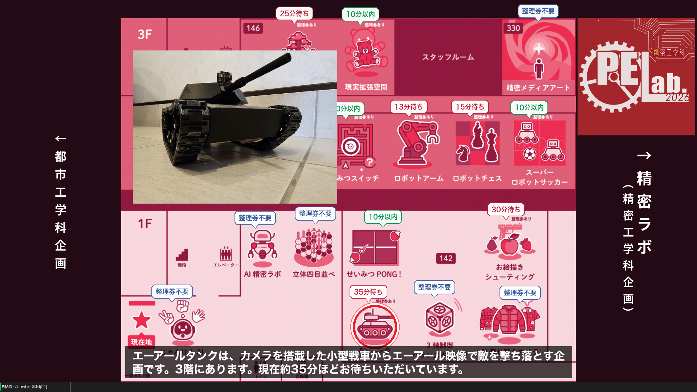

# 精密Lab. 受付・案内ロボット

東大五月祭「精密Lab.」展示向けの受付・案内ロボットシステム。



館内マップをリアルタイムで表示し、Firebase から取得した混雑状況をオーバーレイ表示する。
ブランチによっては音声合成・音声認識・Gemini API との対話機能も搭載。

---

## ブランチ一覧（引き継ぎ資料）

ブランチは **機能追加の積み重ね**で成長している。下記の順で派生している。

```
main
 ├─ no-voicevox          … VOICEVOXなし・gTTS軽量版
 ├─ with-other-exhibits-info … 他団体企画の場所案内を追加
 └─ fullmap              … 全面マップ表示
      └─ face-detection  … 顔検知自動切替・Arduino サーボ制御
           └─ mayfes     … 五月祭2026 実際に使用したブランチ（最終形）
```

### `main` — フル機能の安定版

対話モード付きのフル機能ブランチ。

- **待機モード**: 呼び込みメッセージを VOICEVOX で音声合成して発話、動画をループ再生
- **対話モード**: スペースキーで切替。マイク入力 → Google STT → Gemini API → VOICEVOX 読み上げ
- **Firebase 連携**: 整理券待ち人数をリアルタイムで取得してプロンプトに注入
- **マップ表示**: 企画の場所を脈動アニメーション（赤丸＋波紋）でハイライト

依存: `GEMINI_API_KEY`、VOICEVOX Core（ローカル）、Firebase Admin SDK

### `no-voicevox` — VOICEVOX なし・軽量版

main から VOICEVOX を取り除き gTTS（Google Text-to-Speech）に置き換えたブランチ。
VOICEVOX のモデルダウンロード（数 GB）が不要になるため、環境構築が楽になる。

- TTS を `--tts gtts` / `--tts voicevox` で CLI から切り替え可能
- 起動時間が大幅に短縮される

依存: `GEMINI_API_KEY`、Firebase Admin SDK（VOICEVOX 不要）

### `with-other-exhibits-info` — 他団体企画案内

main に加えて五月祭全体マップを表示し、精密 Lab. 以外の他団体企画の場所も案内できるようにしたブランチ。

- `assets/festival_map.png` として五月祭全体マップを追加
- `stitch_map.py` で複数マップを結合するユーティリティを追加
- Gemini にキャッシュ機能を追加（API コール削減）
- キーボード（矢印キーなど）で企画マップを切り替え可能

依存: `GEMINI_API_KEY`、VOICEVOX Core、Firebase Admin SDK

### `fullmap` — 全面フロアマップ表示

動画エリアを廃止して、画面全体をフロアマップ表示に使うレイアウト変更ブランチ。

- 画面右半分の動画パネルをなくし、マップを全画面表示
- 精密Lab. のロゴ画像を左上にオーバーレイ
- サイドラベル（企画名リスト）を右側に表示
- 企画写真をマップ上にオーバーレイ表示

### `face-detection` — 顔検知自動切替・Arduino サーボ制御

fullmap の全機能＋カメラ顔検知・Arduino 連携を追加した最多機能ブランチ。

- **顔検知自動切替**: OpenCV で来場者の顔を検知し、待機 ↔ 対話モードを自動切替
  - `face_tune.json` で検知パラメータを調整
- **Arduino サーボ制御**: Python が発話状態を USB シリアルで Arduino に送信し、サーボモーターを動かす
  - 発話中: モード 0（servo3, servo5 がランダム動作）
  - 非発話: モード 1（servo10, servo11 がランダム動作）
- **外部マイク対応**: `--mic` オプションでデバイスインデックスを指定
- **OpenAI 移行対応**: Gemini → OpenAI の切り替えを準備（ポスター表示も追加）

依存: `GEMINI_API_KEY`、VOICEVOX Core、Firebase Admin SDK、Arduino（任意）

起動例:
```bash
python main.py --serial /dev/cu.usbmodem1101 --mic 2
```

#### Arduino スケッチ（`arduino_servo.ino`）

サーボ 4 本（ピン 3, 5, 10, 11）を制御。
シリアルで `0\n` または `1\n` を受信するとモードを切り替える。

```
モード 0（発話中）: servo3・servo5 が 1 秒ごとにランダム動作
モード 1（非発話）: servo10・servo11 が 2 秒ごとにランダム動作
```

ボーレート: 115200

### `mayfes` — 五月祭2026 実際使用版（最終形）

**五月祭当日に実際に動かしたブランチ**。face-detection をベースに、会場での運用に合わせて機能を絞り込んだ。

- 対話モード・音声認識・カメラ入力を完全削除（しゃべらないロボット）
- 動画ループ再生を削除
- 呼び込みメッセージを gTTS で合成して一定間隔で発話
- 画面下部に字幕テキストを表示
- 「工学」の誤読み仮名修正（`_WORD_FIXES`）
- Arduino シリアル通信は残存（発話状態を送信）

起動例:
```bash
python main.py
python main.py --serial /dev/cu.usbmodem1101
```

---

## システム構成（mayfes ブランチ）

```
Firebase Firestore（整理券待ち人数）← 30秒ごとにポーリング
    ↓
gTTS（呼び込みメッセージを音声合成）→ スピーカー出力
    ↓
pygame（マップ・字幕・混雑状況を画面表示）
    ↓
Arduino（シリアルで発話状態を送信）→ サーボモーター動作
```

---

## 画面レイアウト

```
┌─────────────────────────────────────────────────────────┐
│                                                         │
│              館内マップ（全画面）                        │
│              ※左上にロゴ、右にサイドラベル              │
│              ※企画ハイライト時は赤丸アニメーション      │
│                                                         │
├─────────────────────────────────────────────────────────┤
│  字幕テキスト（呼び込みメッセージ）                      │ ← 下部
└─────────────────────────────────────────────────────────┘
```

- ウィンドウはリサイズ可能（アスペクト比を維持してスケーリング）

---

## ファイル構成

```
entrance_robot/
├── main.py                    # メインロジック
├── README.md                  # 本ファイル（引き継ぎ資料）
├── arduino_servo.ino          # Arduino サーボ制御スケッチ
├── requirements.txt           # 依存ライブラリ
├── .env                       # APIキー（Git管理外）
├── firebase_admin.json        # Firebase 秘密鍵（Git管理外）
├── face_tune.json             # 顔検知パラメータ（face-detection ブランチ）
├── spec.txt                   # 初期仕様書
├── entrance_robot_instruction.md  # 最初の Claude への依頼内容
├── preview_map.py             # 企画座標確認・調整ツール
├── stitch_map.py              # マップ結合ツール（with-other-exhibits-info）
├── prompts/
│   └── system_prompt.txt      # Gemini へのシステムプロンプト
├── assets/
│   ├── 企画場所.pdf            # 館内フロアマップ（1ページ）
│   ├── logo.png               # 精密Lab. ロゴ
│   ├── festival_map.png       # 五月祭全体マップ（with-other-exhibits-info）
│   └── photos/                # 企画ポスター・写真（PDF形式）
│       └── {キー名}.pdf
├── movies/                    # 待機中ループ動画（main/face-detection ブランチ）
│   └── *.mp4 / *.mov 等
└── voicevox_core/             # VOICEVOX モデル・辞書・ランタイム（main ブランチ）
    ├── onnxruntime/
    ├── dict/
    └── models/
```

---

## セットアップ

### 1. 依存ライブラリのインストール

```bash
pip install -r requirements.txt
```

**mayfes / no-voicevox ブランチ**は VOICEVOX 不要。以下は不要。

**main / face-detection ブランチ**で VOICEVOX を使う場合は追加でインストール:
```bash
pip install "https://github.com/VOICEVOX/voicevox_core/releases/download/0.16.4/voicevox_core-0.16.4-cp310-abi3-macosx_11_0_arm64.whl"
```

### 2. VOICEVOX モデルのダウンロード（main / face-detection ブランチのみ・初回のみ）

```bash
curl -sSfL https://github.com/VOICEVOX/voicevox_core/releases/latest/download/download-osx-arm64 -o download
chmod +x download
./download --exclude c-api
```

### 3. ffmpeg のインストール（mayfes / no-voicevox ブランチで必要）

gTTS で生成した MP3 を WAV に変換するために使用。

```bash
brew install ffmpeg
```

### 4. 環境変数の設定

`.env` ファイルをプロジェクトルートに作成:

```
GEMINI_API_KEY=your_gemini_api_key_here
```

> mayfes ブランチは Gemini を使わないため不要。

### 5. Firebase サービスアカウントキーの設置

1. [Firebase Console](https://console.firebase.google.com/) → プロジェクト設定 → サービスアカウント
2. 「新しい秘密鍵の生成」で JSON ファイルをダウンロード
3. プロジェクトルートに `firebase_admin.json` という名前で配置

```
entrance_robot/
└── firebase_admin.json   ← ここに置く（.gitignore 済み）
```

### 6. 起動

```bash
# 基本起動
python main.py

# Arduino あり（face-detection / mayfes ブランチ）
python main.py --serial /dev/cu.usbmodem1101

# 外部マイク指定（face-detection ブランチ）
python main.py --mic 2

# TTS 切替（no-voicevox ブランチ）
python main.py --tts gtts
python main.py --tts voicevox
```

---

## コンテンツの追加・更新

### 企画ポスターの追加

```
assets/photos/{キー名}.pdf
```

キー名は `EXHIBIT_KEY_MAP` の左辺と一致させること（例: `truck`, `space`, `media`）。

### 企画座標の調整

`preview_map.py` で座標を確認しながら調整できる:

```bash
python preview_map.py
```

調整後は `main.py` の `EXHIBIT_LOCATIONS` を更新:

```python
"ジャングル・スコープ": {"x": 0.393, "y": 0.086, "bx": 0.381, "by": 0.016},
#                        ↑マップ上の赤丸       ↑吹き出しの位置
```

### 呼び込みメッセージの変更

`main.py` の `STANDBY_MESSAGES` を編集（変更後は再起動で再合成）:

```python
STANDBY_MESSAGES = [
    "精密ラボへようこそ！...",
]
```

### 企画・混雑状況の追加

新しい企画を案内対象に追加するには:

1. `EXHIBIT_KEY_MAP` にキーと企画名を追加
2. `EXHIBIT_LOCATIONS` に座標を追加
3. `assets/photos/{キー名}.pdf` に写真を追加
4. `prompts/system_prompt.txt` に企画の説明を追記

---

## パラメータ調整

`main.py` 冒頭の定数で動作を調整できる。

| 定数                     | 初期値    | 説明                                              |
| ------------------------ | --------- | ------------------------------------------------- |
| `FIREBASE_POLL_INTERVAL` | 30        | Firebase ポーリング間隔（秒）                     |
| `DISPLAY_WIDTH`          | 1200      | ウィンドウ幅（px）                                |
| `DISPLAY_HEIGHT`         | 700       | ウィンドウ高さ（px）                              |
| `STANDBY_INTERVAL_RANGE` | (10, 15)  | 呼び込み発話の間隔（秒）の最小・最大              |

main ブランチ固有:

| 定数               | 初期値 | 説明                                                         |
| ------------------ | ------ | ------------------------------------------------------------ |
| `MIC_THRESHOLD`    | 800    | マイク感度（高いほど鈍感）                                   |
| `LISTEN_TIMEOUT`   | 8      | 無音タイムアウト（秒）。この時間無音なら待機モードへ         |
| `VOICEVOX_SPEAKER` | 8      | 話者ID（8: 春日部つむぎ、1: ずんだもん）                    |

---

## スレッド構成（main ブランチ）

```
メインスレッド          : pygame イベント処理・描画（30fps）
├─ 待機/対話スレッド    : モードロジック・音声合成・認識
├─ 動画再生スレッド     : OpenCV フレームデコード → キュー
├─ 音量モニタースレッド : PyAudio でリアルタイム RMS 計測
└─ Firebase ポーラー   : 30 秒ごとに混雑状況を取得
```

---

## 注意事項

- VOICEVOX の音声を使用する際は「VOICEVOX:春日部つむぎ」のクレジット表記が必要
- Gemini API は無料枠に制限あり。使い切ると 429/503 エラーが発生するが、自動でエラーメッセージを発話してリトライ待機する
- Google STT・Gemini API はインターネット接続が必要（gTTS も同様）
- `debug.log` にログが出力される（起動ごとに上書き）
- `firebase_admin.json` と `.env` は Git 管理外。次回利用時は各自で再取得・再配置が必要
